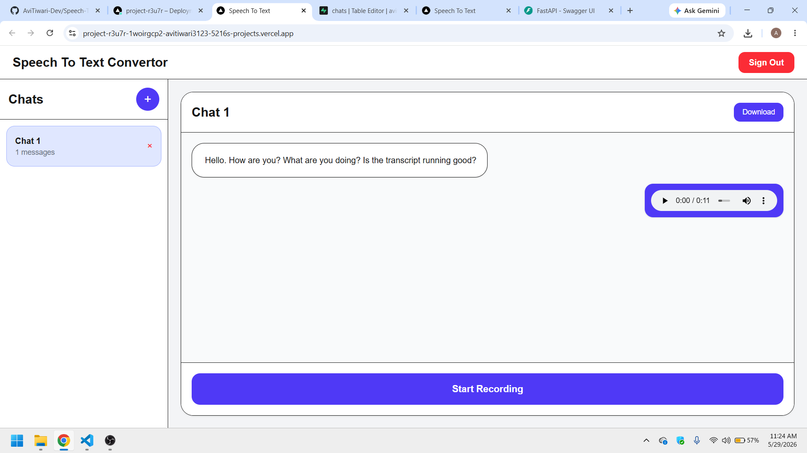
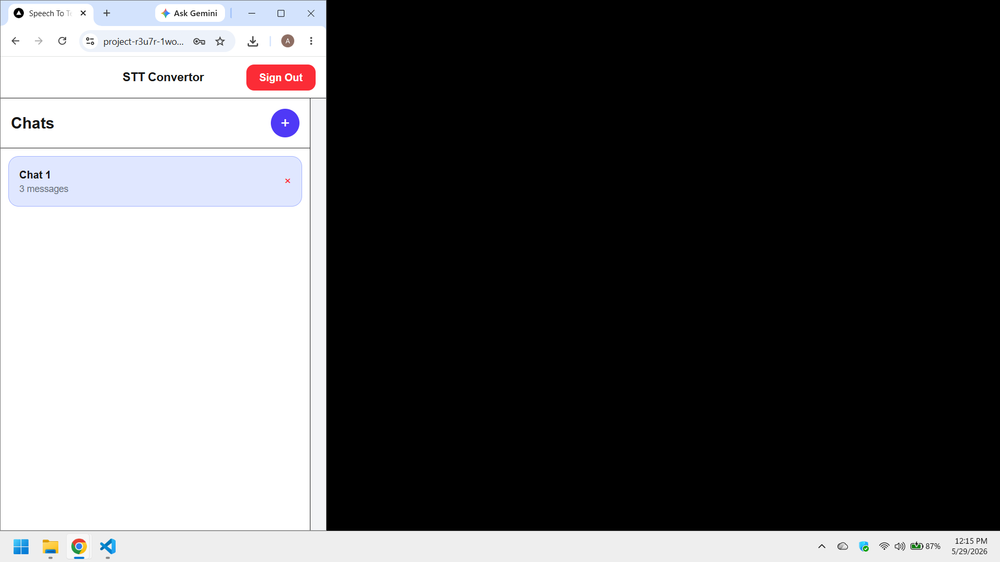
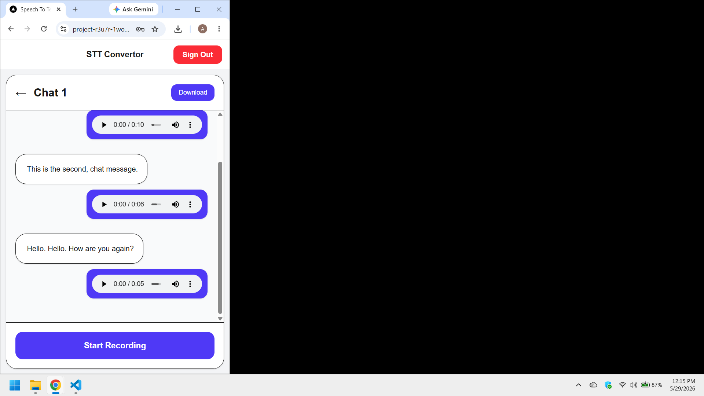
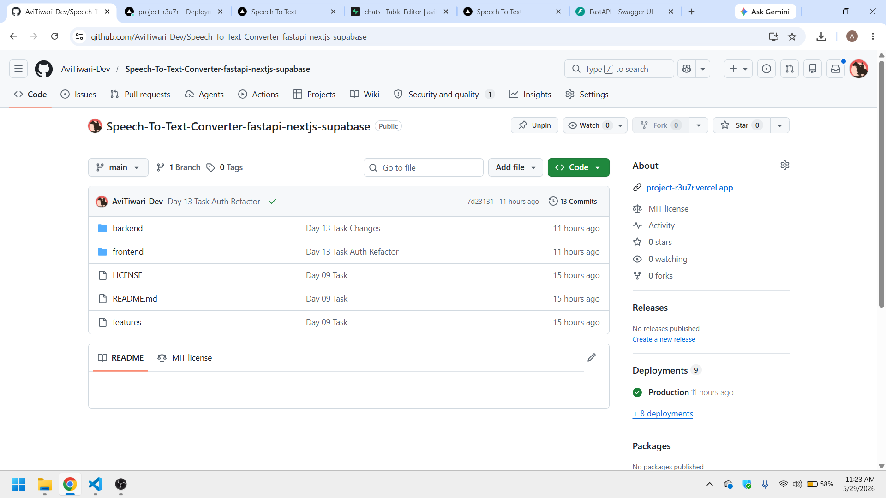
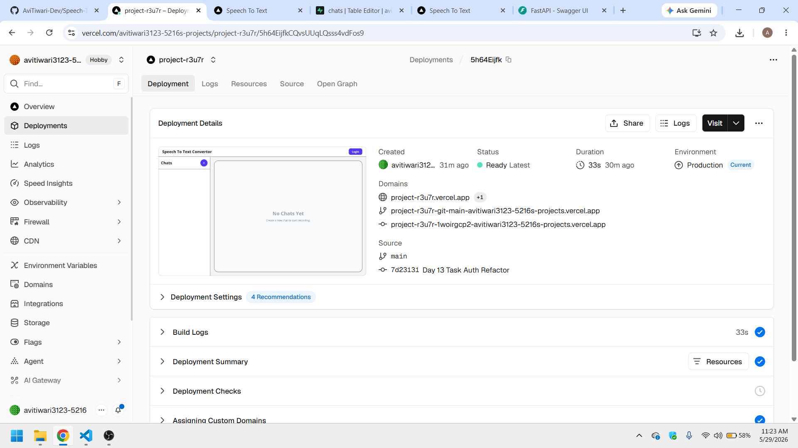
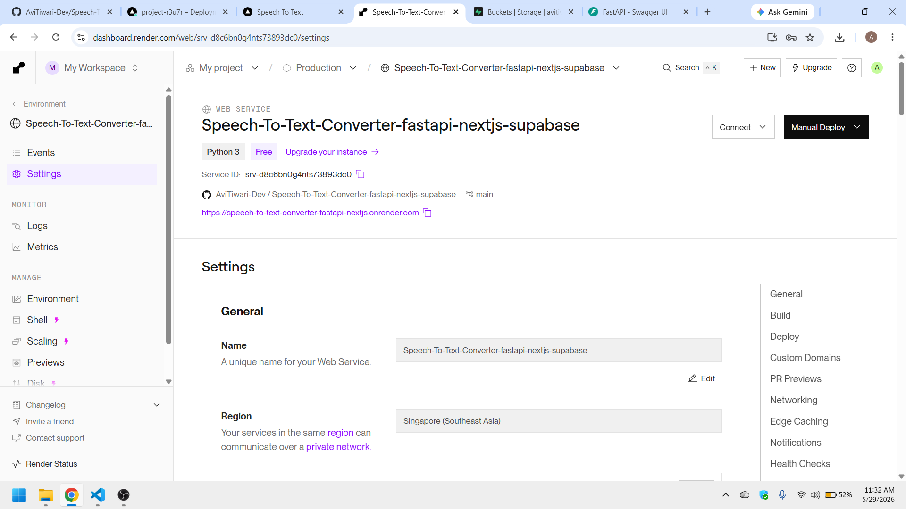
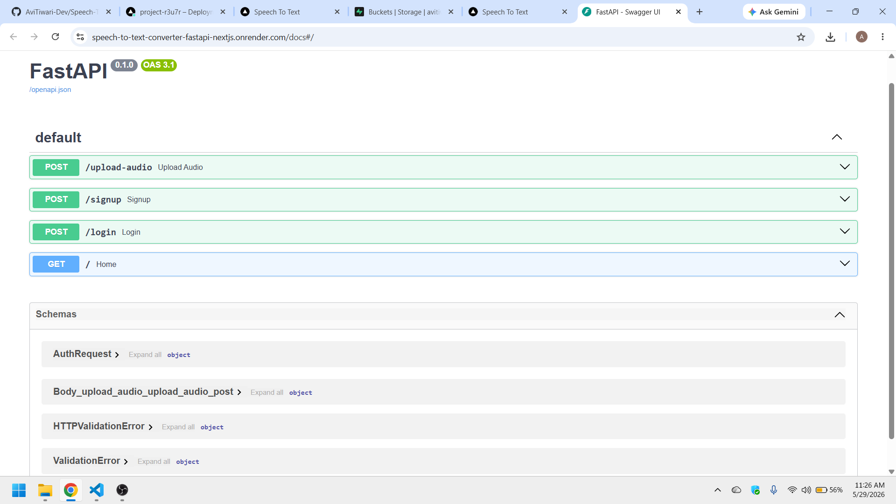
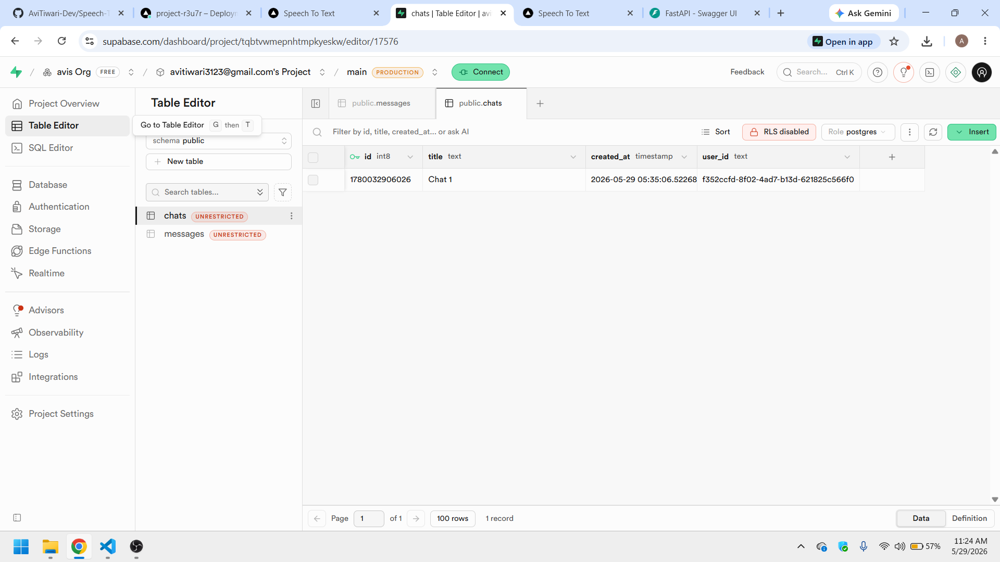
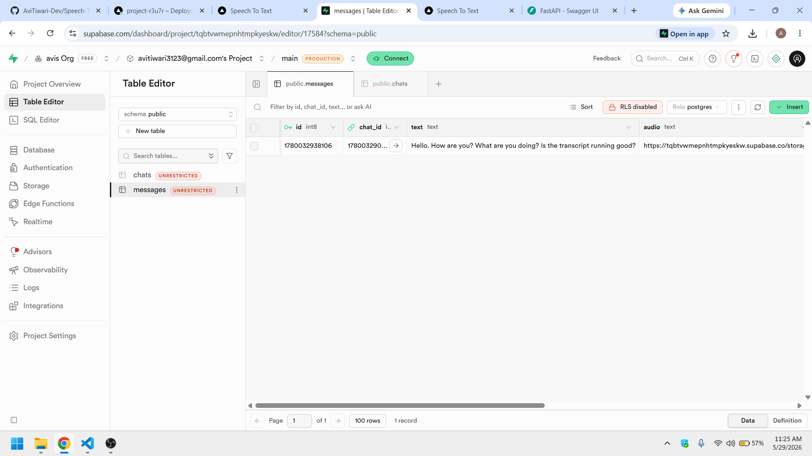
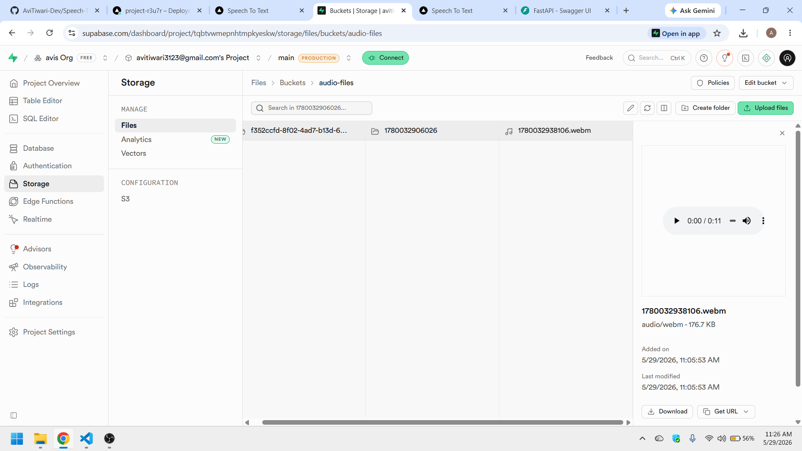

# AI Voice Transcript Chat App

A full-stack real-time voice transcription application built using FastAPI, Next.js, Supabase, and Deepgram Speech-to-Text APIs.

The application allows users to record audio conversations, generate live transcripts using WebSockets, store transcripts and audio recordings in Supabase, and manage conversations through an authenticated chat interface.

---

# Live Deployment

## Frontend

Deployed on Vercel

## Backend

Deployed on Render

---

# Tech Stack

## Frontend

- Next.js
- React
- Tailwind CSS

## Backend

- FastAPI
- WebSockets
- Async Python

## Database & Storage

- Supabase PostgreSQL
- Supabase Storage Buckets

## Speech-to-Text

- Deepgram API

---

# Features

## Authentication

- User Signup
- User Login
- User Logout
- Persistent Session Management
- Protected Recording Access

---

## Real-Time Speech Transcription

- Live transcription using WebSockets
- Low-latency streaming audio processing
- Real-time transcript updates while speaking
- Async backend processing using FastAPI

---

## Audio Recording Features

- Record audio directly from browser microphone
- Store audio recordings in Supabase Storage
- Playback recorded audio
- Pause and resume audio
- Adjust audio volume
- Change playback speed
- Forward and backward seeking
- Download recorded audio files

---

## Chat Management

- Create chats
- Delete chats
- Store chats per authenticated user
- Maintain chat history
- Auto-load chats from database
- Real-time transcript updates inside chats

---

## Transcript Features

- Save transcripts in database
- Download full chat transcript
- Persistent transcript history

---

# Architecture Overview

## Frontend Flow

1. User logs in
2. User creates/selects a chat
3. Audio stream captured from microphone
4. Audio streamed to backend using WebSockets
5. Deepgram API processes speech
6. Live transcript returned to frontend
7. Final transcript and audio uploaded to backend
8. Audio stored in Supabase Storage
9. Transcript stored in Supabase Database

---

# Database Structure

## Chats Table

```sql
create table chats (
  id bigint primary key,
  title text,
  user_id text,
  created_at timestamp default now()
);
```

## Messages Table

```sql
create table messages (
  id bigint primary key,
  chat_id bigint references chats(id) on delete cascade,
  text text,
  audio text,
  audio_path text,
  live boolean default false,
  user_id text,
  created_at timestamp default now()
);
```

---

# Key Technical Implementations

## WebSocket Streaming

Used WebSockets for:

- low latency communication
- real-time transcript streaming
- continuous audio processing

---

## Async Backend

FastAPI async endpoints used for:

- audio uploads
- websocket handling
- transcript processing
- concurrent client handling

---

## Supabase Integration

- PostgreSQL database storage
- Secure object storage for audio recordings
- Authentication integration
- Row Level Security policies

---

# Deployment

## Frontend Deployment

Platform: Vercel

### Features

- Automatic deployments
- Environment variable management
- Optimized Next.js hosting

---

## Backend Deployment

Platform: Render

### Features

- Python FastAPI hosting
- Persistent API hosting
- Environment variable configuration

---

# Environment Variables

## Frontend

```env
NEXT_PUBLIC_API_URL=YOUR_BACKEND_URL
```

## Backend

```env
SUPABASE_URL=YOUR_SUPABASE_URL
SUPABASE_SERVICE_ROLE_KEY=YOUR_SERVICE_ROLE_KEY
DEEPGRAM_API_KEY=YOUR_DEEPGRAM_API_KEY
```

---

# Future Improvements

- Streaming transcript persistence while speaking
- Auto-generated chat titles
- Multi-language transcription
- Real-time translation
- Audio waveform visualization
- Chat search functionality
- User profile management
- Chat sharing
- Export transcripts as PDF
- Mobile responsiveness improvements

---

# Learning Outcomes

This project demonstrates:

- Full-stack application development
- Real-time WebSocket communication
- Async backend architecture
- Authentication systems
- Cloud deployment workflows
- External API integrations
- Database design
- Audio processing
- Production debugging
- CORS and deployment handling

---

# Screenshots

Speech To Text Converter Application (Desktop View)



Speech To Text Converter Application (Mobile View 01)



Speech To Text Converter Application (Mobile View 02)



GitHub Repository



Deployment Frontend Vercel



Deployment Backend Render



Swagger Ui



Supabase Table Chats



Supabase Table Messages



Supabase Storage Bucket



---

# Author

Developed as a real-time AI voice transcription platform using modern full-stack technologies.
